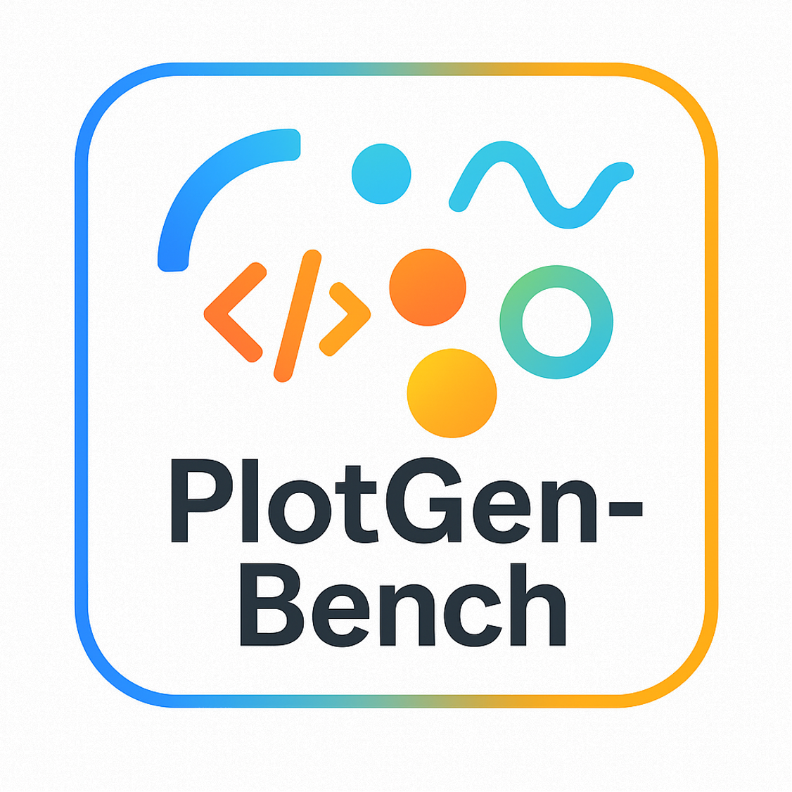

<div align="center">

<h1> PlotGen-Bench: Evaluating VLMs on Generating Visualization Code from Diverse Plots across Multiple Libraries
 </h1>
</div>

<div align="center">


</div>

<div align="center">
  <!-- <a href="#model">Model</a> • -->
  🌐 <a href="https://plotgen.github.io/">Website</a> |
  🏆 <a href="https://plotgen.github.io/">Leaderboard</a> |
  📚 <a href="https://huggingface.co/datasets/stormsemper1/PlotGen-Bench">Data</a> |
  📃 <a href="https://arxiv.org/abs/xxx">Paper</a>
</div>


## 🎏 Introduction

Recent advances in vision–language models (VLMs) have expanded their multimodal code generation capabilities, yet their ability to generate executable visualization code from plots, especially for complex 3D, animated, plot-to-plot transformations, or multi-library scenarios, remains underexplored. To address this gap, we introduce PlotGen-Bench, a comprehensive benchmark for evaluating plot-to-code generation under realistic and complex visualization scenarios. The benchmark spans 9 major categories, 30 subcategories, and 3 core tasks—plot replication, plot transformation, and multi-library generation, covering both 2D, 3D and animated plots across 5 widely used visualization libraries. Through systematic evaluation of state-of-the-art open- and closed-source VLMs, we find that open-source models still lag considerably behind in visual fidelity and semantic consistency, despite achieving comparable code executability. Moreover, all models exhibit substantial degradation on reasoning-intensive tasks such as chart type conversion and animation generation. PlotGen-Bench establishes a rigorous foundation for advancing research toward more capable and reliable VLMs for visualization authoring and code synthesis, with all data and code available at https://plotgen.github.io.

<div align="center">

</div>

## 📄 Table of Contents

<!-- <details>
<summary>
Click to expand the table of contents
</summary>

- [🎉 What's New](#whats-new)
- [🎏 Introduction](#introduction)
- [🚀 Quick Start](#-quick-start)
  - [Setup Environment](#setup-environment)
  - [Download Data](#download-data)
  - [Evaluate Models](#evaluate-models)
- [📚 Data](#-data)
- [💬 Citation](#-citation)
- [📌 License](#-license)
- [🎙️ Acknowledgements](#️-acknowledgements)

</details> -->

## 🚀 Quick Start

Here we provide a quick start guide to evaluate VLMS on PlotGen-Benchmark.

### Setup Environment

```shell
conda env create -f environment.yaml
conda activate plotgen
```
<!-- 
Set up the environment variables.

```shell

``` -->

### Download Data

You can download the whole evaluation data by running the following command:

```shell
cd plotgen 

```
```
curl -X GET \
     "https://datasets-server.huggingface.co/rows?dataset=stormsemper1%2FPlotGen-Bench&config=default&split=train&offset=0"
```

### Evaluate Models

#### Task 1&3: Direct Mimic

Example script for `gpt-4-vision-preview` on the `Direct Mimic` task:

```shell

# Step 1: generate code
bash scripts/static_replication/run_generation.sh

# Step 2: render code
bash scripts/static_replication/run_code.sh

# Step 3: Get score
bash scripts/static_replication/run_evaluation_lowlevel.sh


```


## 📚 Data

You can download the whole evaluation data by running the following command:


```shell
from datasets import load_dataset

ds = load_dataset("stormsemper1/PlotGen-Bench")
```

The file structure of evaluation data is as follows:

```
.
├── images_render-human/
├── convert_render-human/
├── gif_render-human/
├── metadata-replication.jsonl/
├── metadata-convert.jsonl/
└── metadata-gif.jsonl/

```

## 💬 Citation

If you find this repository useful, please consider giving star and citing our paper:

```
@article{
    zhao2025plotgenbench,
    title={PlotGen-Bench: Evaluating VLMs on Generating Visualization Code from Diverse Plots across Multiple Libraries},
    author={Yi Zhao and Zhen Yang and Shuaiqi Duan and Wenmeng Yu and Zhe Su and Jibing Gong and Jie Tang},
    year={2025},
    journal={arXiv preprint arXiv:xxxx.xxxxx},
}
```

## 📌 License

[](https://www.apache.org/licenses/LICENSE-2.0)

The PlotGen data and codebase is licensed under a [Apache-2.0 License](https://www.apache.org/licenses/LICENSE-2.0).

